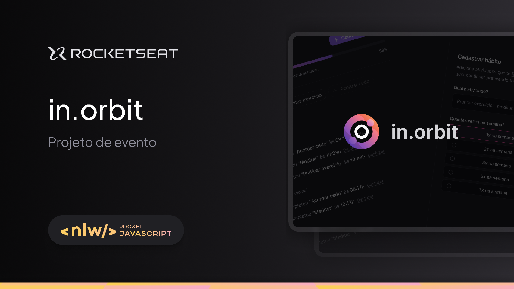

# NLW POCKET - FRONTEND
Frontend da Aplicação in.orbit feito durante o NLW POCKET

<h1 align="center">
  
</h1>


<br>

## 💻 Tecnologias Utilizadas nesse Projeto
<div style="display: inline_block">
  
  
  
</div>

<br>

## Especificações
- Node: 20.14.0
- Pacote de Gerenciamento de Dependências: NPM
- Framework: Vite + React

<br>

## Observações
Necessário configurar um arquivo .env antes de rodar o projeto
```bash
VITE_REACT_API_URL="https://nlw-pocket-backend.onrender.com"
```

<br>

## Como instalar as dependências
```bash
$ npm install
```

## Rodar o Projeto
```bash
$ npm run dev
```

<br>

## Link Deploy - Vercel
https://nlw-pocket-frontend.vercel.app/